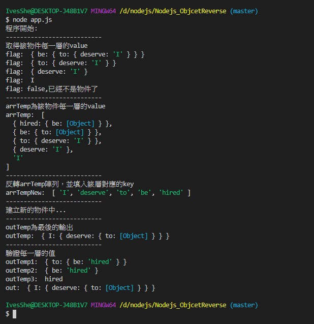
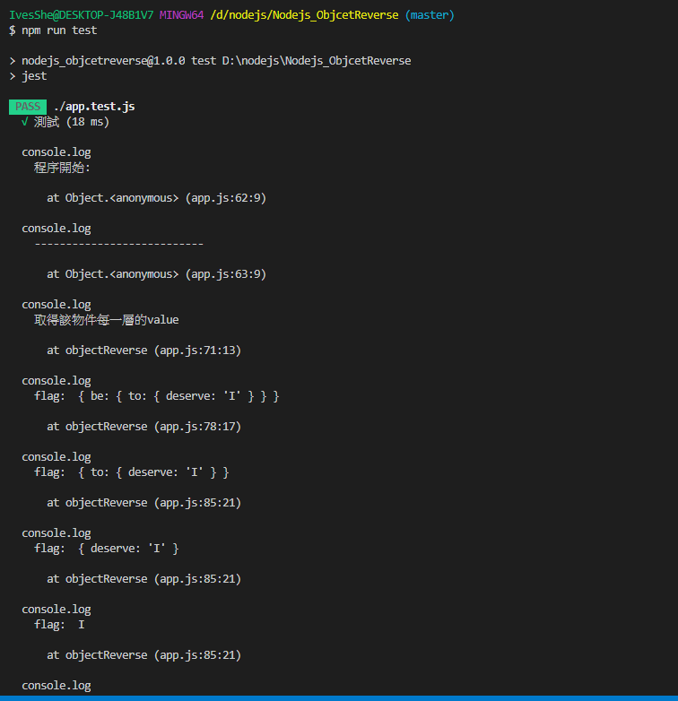
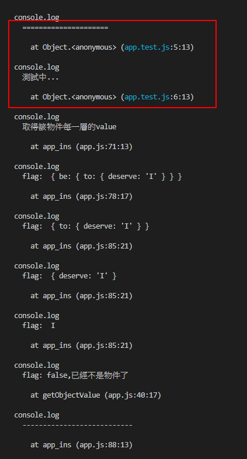
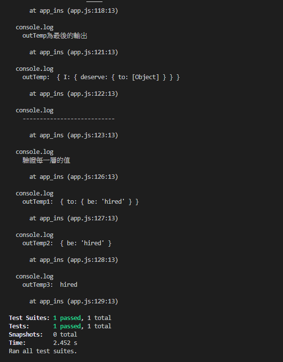

# 物件反轉

```js
// 預想的 Input:
let inputValue = {
    hired: {
        be: {
            to: {
                deserve: 'I'
            }
        }
    }
};

// 希望的 Output:
let outputValue = {
    I: {
        deserve: {
            to: {
                be: 'hired'
            }
        }
    }
};

```

# 思路分析

1. 將每一層的value捉取出來放到陣列arrTemp，包括最原始的inputValue
2. 反轉arrTemp陣列，並填入該層對應的key，輸出到arrTempNew
3. 建立新的物件outTemp並打印
4. 驗證outTemp每一層並打印

# 安裝JEST

```bash
npm init -y
npm install jest --save-dev
```

修改package.json，將script新增jest

```json
"scripts": {
    "test": "jest"
  },
```

# 執行畫面

```bash
node app.js
```



# 測試畫面

```bash
npm run test
```







# 代碼

## app.js

```js
// 預想的 Input:
let inputValue = {
    hired: {
        be: {
            to: {
                deserve: 'I'
            }
        }
    }
};

// 希望的 Output:
let outputValue = {
    I: {
        deserve: {
            to: {
                be: 'hired'
            }
        }
    }
};

// 判斷是否為物件
var getDataType = function (o) {
    if (typeof o == "object") {
        if (typeof o.length == "number") {
            return "Array";
        } else {
            return "Object";
        }
    } else {
        return "param is no object type";
    }
};

// 取得物件的value
var getObjectValue = (obj) => {
    let value;
    if (getDataType(obj) != "Object") {
        console.log("flag: false,已經不是物件了");
        return false;
    }
    for (let k in obj) {
        value = obj[k]; // 捉取value值
    }
    return value;
}

// 取得物件的key
var getObjectKey = (obj) => {
    let key;
    if (getDataType(obj) != "Object") {
        console.log("flag: false,已經不是物件了");
        return false;
    }
    for (let k in obj) {
        key = k; // 捉取key值
    }
    return key;
}

console.log("程序開始: ");
console.log("--------------------------- ");


var objectReverse = (inputValue) => {
    let arrTemp = [];
    let arrTempNew = [];
    let flag = true;

    console.log("取得該物件每一層的value");

    arrTemp.push(inputValue);
    flag = getObjectValue(inputValue);

    if (flag != false) {
        arrTemp.push(flag);
        console.log("flag: ", flag);
    }

    while (flag != false) {
        flag = getObjectValue(flag);
        if (flag != false) {
            arrTemp.push(flag);
            console.log("flag: ", flag);
        }
    }
    console.log("--------------------------- ");

    // 該物件每一層的value
    console.log("arrTemp為該物件每一層的value");
    console.log("arrTemp: ", arrTemp);
    console.log("--------------------------- ");

    for (let i = arrTemp.length - 1; i >= 0; i--) {
        if (i == arrTemp.length - 1) {
            arrTempNew.push(arrTemp[i]);
        } else {
            arrTempNew.push(getObjectKey(arrTemp[i]));
        }
    }

    // 反轉arrTemp陣列，並填入該層對應的key
    console.log("反轉arrTemp陣列，並填入該層對應的key");
    console.log("arrTempNew: ", arrTempNew);
    console.log("--------------------------- ");

    // 創建新的物件
    // 建立的部分，暫時沒想到好的迴圈解法，主要是也沒有用純代碼拼接過物件，這裡就先直接寫死輸出
    console.log("建立新的物件中...");
    let outTemp = {};
    let outNew = {};

    outTemp[arrTempNew[0]] = {};
    outTemp[arrTempNew[0]][arrTempNew[1]] = {};
    outTemp[arrTempNew[0]][arrTempNew[1]][arrTempNew[2]] = {};
    outTemp[arrTempNew[0]][arrTempNew[1]][arrTempNew[2]][arrTempNew[3]] = arrTempNew[4];
    console.log("--------------------------- ");

    // 最後輸出
    console.log("outTemp為最後的輸出");
    console.log("outTemp: ", outTemp);
    console.log("--------------------------- ");

    // 驗證每一層的值
    console.log("驗證每一層的值");
    console.log("outTemp1: ", outTemp[arrTempNew[0]][arrTempNew[1]]);
    console.log("outTemp2: ", outTemp[arrTempNew[0]][arrTempNew[1]][arrTempNew[2]]);
    console.log("outTemp3: ", outTemp[arrTempNew[0]][arrTempNew[1]][arrTempNew[2]][arrTempNew[3]]);

    return outTemp;
}

let out = objectReverse(inputValue);
console.log("out: ",out);

module.exports = objectReverse;
```

## app.test.js

```js
const { test, expect } = require("@jest/globals");
const app_ins = require("./app");

test("測試",()=>{
    console.log("=====================");
    console.log("測試中...");
    const input = {
        hired: {
            be: {
                to: {
                    deserve: 'I'
                }
            }
        }
    };
    const out = {
        I: {
            deserve: {
                to: {
                    be: 'hired'
                }
            }
        }
    };
    
    expect(app_ins(input)).toEqual(out);
});
```